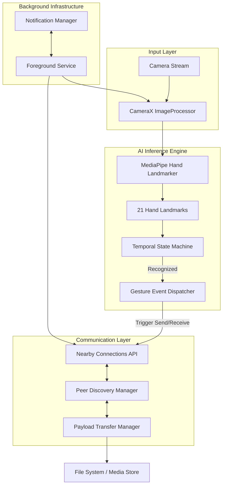
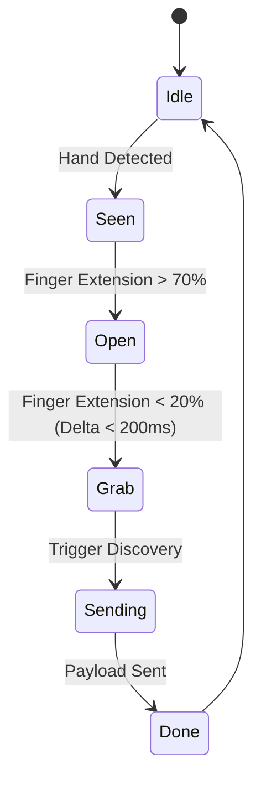

# AirSync: The Future of Touchless File Transfer

AirSync is a revolutionary Android application that redefines file sharing through **Human-Computer Interaction (HCI)**. It enables users to transfer digital files between devices using intuitive, hand-gestures—mimicking the physical act of "grabbing" an object and "throwing" it through space.

---

## 📖 Table of Contents
1. [Vision & Concept](#-vision--concept)
2. [Core Interaction Model](#-core-interaction-model)
3. [System Architecture](#-system-architecture)
4. [AI & Computer Vision Deep Dive](#-ai--computer-vision-deep-dive)
5. [Networking & Communication](#-networking--communication)
6. [Background Service & Optimization](#-background-service--optimization)
7. [Security & Privacy](#-security--privacy)
8. [Setup & Deployment](#-setup--deployment)
9. [Roadmap](#-roadmap)

---

## 🌌 Vision & Concept
Traditional file sharing requires navigating through menus, scanning QR codes, or selecting contacts. **AirSync** removes these friction points by leveraging the phone's camera as a spatial sensor. 

The goal is to make digital data feel physical. By recognizing the intent behind a "Grab" and a "Release," the system creates a seamless bridge between two devices, making technology feel like an extension of natural human movement.

---

## 🎮 Core Interaction Model

The system operates on two primary gesture-driven states:

### 1. The "Grab" (Source Device)
- **Visual Trigger**: The user points their hand at the screen (Open Palm).
- **Physical Action**: The user closes their fingers into a fist (The "Capture").
- **Haptic/Visual Feedback**: The screen "pulses" to indicate the file is now virtually held by the user.
- **System Action**: The file is serialized and the device starts broadcasting its availability via Nearby Connections.

### 2. The "Release" (Target Device)
- **Visual Trigger**: The receiver device's camera monitors for incoming intentionality.
- **Physical Action**: The user performs an "Open Palm" gesture towards the screen (The "Release").
- **Haptic/Visual Feedback**: A progress bar appears as the "thrown" file is caught.
- **System Action**: The connection is accepted, and the payload is written to local storage.

---

## 🏗️ System Architecture

AirSync is designed with a highly modular architecture to ensure low latency and high reliability.

### High-Level Architecture Diagram

### Module Breakdown
- **Vision Pipeline**: Decoupled from the UI to allow 30fps landmark tracking without dropping frames.
- **Nearby Manager**: Handles the complex handshake between Android devices using Bluetooth Low Energy (BLE) for discovery and WiFi Direct for data.
- **Service Layer**: Ensures the app stays "alive" even when the user switches to another app, keeping the gesture-radar active.

---

## 🧠 AI & Computer Vision Deep Dive

The "Magic" of AirSync lies in its ability to understand *intent* over time, rather than just static poses.

### Hand Landmark Tracking
We track **21 specific points** on the hand. 
- **Landmarks 0**: Wrist position.
- **Landmarks 4, 8, 12, 16, 20**: Fingertips.
- **Landmarks 1-3, 5-7...**: Finger joints.

### Gesture Decision Logic
Instead of a simple classifier, we use a **Temporal State Machine**:
1. **Idle State**: No hand detected.
2. **Intent State**: Hand is visible and open (Landmarks 4, 8, 12, 16, 20 are extended).
3. **Action Trigger**: Distance between Landmarks 4 (Thumb) and 8 (Index) decreases rapidly below a threshold while Landmark 12-20 also retract (The "Clench").

---

## 📡 Networking & Communication

AirSync leverages **Google Nearby Connections API**, a standard for high-bandwidth, low-latency P2P sharing.

### Connection Strategy: `P2P_STAR`
- **Discovery**: Uses a combination of BLE and MDNS to find peers without an access point.
- **Bandwidth**: Once paired, the system upgrades to a high-speed WiFi Hotspot or WiFi Direct connection.
- **Protocol**:
    - **Handshake (64-bit)**: Verification of gesture intent.
    - **Header**: Filename, Size, Type.
    - **Payload**: Raw binary data stream.

---

## 🔋 Background Service & Optimization

To prevent battery drain while maintaining 24/7 readiness, we implement several power-saving strategies:

1. **Resolution Throttling**: The camera resolution is dropped to **480p** for AI processing. High-res images are not needed for 21-point landmarking.
2. **Inference Skipping**: If no hand is detected in the frame for 5 consecutive seconds, the FPS drops from **30fps to 10fps** to save CPU cycles.
3. **Hardware Acceleration**: The MediaPipe pipeline is offloaded to the **GPU (OpenGL)**, leaving the CPU free for networking and file I/O.

---

## 🔒 Security & Privacy

- **On-Device Processing**: No camera data or hand landmarks ever leave the device. All AI inference is performed locally using TFLite.
- **Intent-Based Pairing**: Connections are only established when *both* devices detect complementary gestures within a specific timeframe.
- **Secure Payloads**: All data is encrypted over the P2P connection using the Nearby Connections' native security layer.

---

## 🚀 Setup & Deployment

### Hardware Requirements
- Android Version: 8.0+ (Oreo)
- RAM: 4GB+ Recommended
- Camera: Front-facing (Back-facing optional)

### Build Instructions
1. Open the project in **Android Studio Hummingbird or later**.
2. **File -> Sync Project with Gradle Files**.
3. Install the **MediaPipe Tasks** dependency (integrated via `build.gradle`).
4. Connect two Android devices with Developer Options enabled.
5. Build and Run.

---

## 👨‍💻 Development Team & Context
This project was developed as part of the **2026 Christ Hackathon**. It represents a leap forward in the integration of Edge AI and P2P networking to create a more natural computing experience.

---

## 📈 Roadmap: The Future of AirSync
- [ ] **Multi-Point Throw**: "Throw" a file to a specific device in a group by pointing towards it.
- [ ] **Wearable Integration**: Using smartwatches as the "Grab" trigger.
- [ ] **Spatial 3D Tracking**: Using depth sensors (LiDAR) on high-end devices for precise "Air-Dropping" accuracy.

---
*© 2026 AirSync Team. Dedicated to the advancement of Touchless HCI.*
